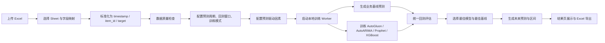
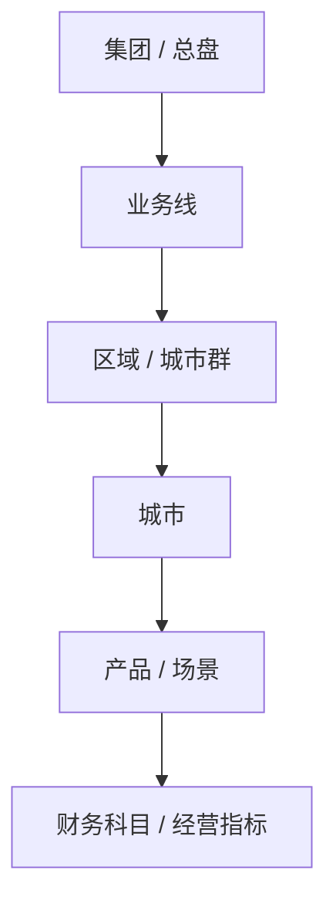
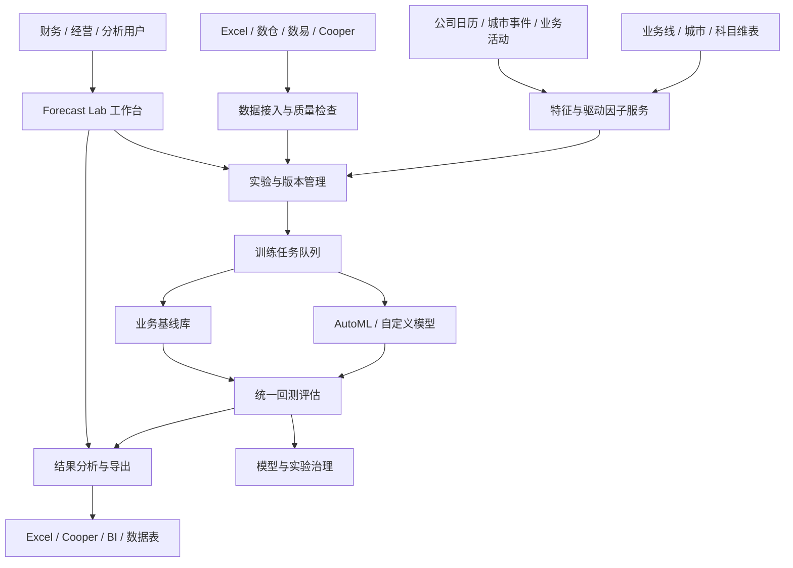

# Forecast Lab 项目整体逻辑与改进方向

> 目标：在理解当前项目实现的基础上，结合滴滴企业特性与预测系统通用性，沉淀一份可持续改进的产品与工程路线图。  
> 当前定位：Forecast Lab 是“财务预测能力评测台”，优先回答数据是否可预测、模型是否稳定优于业务基线，而不是直接替代预算编制或经营决策。

## 1. 一句话理解本项目

Forecast Lab 通过 Excel 上传、字段映射、数据质量检查、滚动回测、业务基线、AutoGluon/自定义模型、指标评测、结果分析与 Excel 导出，帮助财务和业务同学判断：

- 某个财务或经营指标是否具备稳定预测性。
- 复杂模型是否真的优于同比、环比、移动平均等简单业务基线。
- 哪些序列、哪些期间、哪些业务假设导致预测风险。
- 当前数据是否足以支撑更自动化、更规模化的 Forecast 流程。

它的核心价值不是“给一个看起来精准的未来数字”，而是建立一套可验证、可复盘、可解释的预测评测机制。

## 2. 当前系统主链路

当前主链路有几个非常好的底层判断：

1. 先做数据质量检查，再进入训练。
2. 使用时间顺序滚动回测，避免随机切分带来的“偷看未来”。
3. 业务基线始终参与统一排行榜，避免复杂模型天然被高估。
4. 用 WAPE、MAE、RMSE、Bias、Coverage 同时评价精度、方向偏差和区间可信度。
5. Worker 子进程训练，页面只负责配置、轮询和展示，避免 Streamlit 被模型对象拖垮。
6. 所有实验产物落在独立目录，便于复盘、导出和后续迁移。

## 3. 当前工程结构理解

项目整体是一个单仓库、单应用、单机可运行的 Streamlit MVP，主要分为以下层次：

| 层次 | 关键文件 | 当前职责 |
|---|---|---|
| 页面入口 | `app.py`、`pages/*.py` | 实验列表、新建实验、运行状态、结果分析 |
| 领域模型 | `src/domain/models.py`、`src/domain/enums.py` | 实验配置、数据画像、指标、运行状态 |
| 数据处理 | `src/services/excel_service.py`、`mapping_service.py`、`data_quality_service.py` | Excel 读取、字段推断、标准化、质量检查 |
| 预测驱动 | `src/services/forecast_driver_service.py` | 协变量、增长率、事件影响、手工情景假设 |
| 模型层 | `baseline_service.py`、`autogluon_service.py`、`custom_model_service.py` | 业务基线、AutoGluon、自定义 AutoARIMA/Prophet/XGBoost |
| 评测层 | `evaluation_service.py` | 统一指标、排行榜、窗口表现、业务结论 |
| 结果输出 | `chart_service.py`、`export_service.py` | 图表与 Excel 报告 |
| 任务执行 | `src/jobs/job_runner.py`、`train_worker.py` | 启动训练子进程、更新进度、落盘结果 |
| 存储层 | `src/repositories/*`、`src/storage/*` | SQLite 元数据、Parquet 明细、本地文件 |
| 内网部署 | `deploy/*`、`docker-compose.yml`、`Dockerfile` | nginx、SSO sidecar、容器化部署 |

这套结构适合阶段一评测台。后续如果要发展成企业级预测平台，需要在“业务口径治理、特征治理、任务调度、模型治理、权限审计、结果回写”几个方向上逐步增强，而不是一上来重写成大平台。

## 4. 预测逻辑拆解

### 4.1 数据标准化逻辑

系统将用户上传的任意 Excel 表统一映射为三类核心字段：

- `timestamp`：预测时间点，支持月、周、日。
- `item_id`：预测序列，由组织、业务线、科目、产品等维度拼接形成。
- `target`：需要预测的金额或指标。

此外还支持：

- 已知未来协变量：如计划订单量、工作日数、预算人数。
- 历史滞后协变量：如实际燃油价格、历史流量、天气结果。
- 静态属性：如业务线、城市等级、科目类型、组织属性。

这个抽象是通用预测系统的正确骨架，因为绝大多数企业预测问题都可以归约为：

> 在某个时间粒度上，对多个业务实体的某个目标值进行多序列预测，并用可解释的业务特征补充历史趋势。

### 4.2 数据质量逻辑

当前数据质量检查覆盖：

- 时间解析失败。
- 目标值缺失或非数值。
- 同一序列同一期间重复。
- 序列长度不足。
- 历史长度偏短。
- 零值比例过高。
- 负数提示。
- 时间断档。
- 未来协变量预填行识别。

这很符合企业 Forecast 场景：预测失败通常不只是模型问题，更多来自口径不一致、历史过短、数据断档、异常事件未标注、未来驱动缺失。

建议后续将数据质量从“是否能训练”升级为“是否能被信任”，新增：

- 口径漂移检查：同一指标在历史中是否存在统计口径变化。
- 结构断点检查：业务切换、组织调整、计费规则变化导致的序列断层。
- 异常事件标注：春节、疫情、政策、补贴策略、大促、极端天气。
- 数据新鲜度检查：最后一期数据是否已结账、是否为预估数。
- 维度完整性检查：城市、业务线、科目是否出现突然缺失或新增。

### 4.3 模型与基线逻辑

当前候选方法包括三类：

1. 业务基线：Last Value、Seasonal Naive、Rolling Mean、YoY、WoW、MTD Daily Avg、YoY Weekday WoW、YoY Weekday WoW Original、YoY Weekday WoW Hybrid、YoY Weekday DoD。
2. AutoGluon TimeSeries：SeasonalNaive、ETS、Theta、RecursiveTabular、DirectTabular、LightGBM 后端，以及深度档位的 DeepAR、TFT、PatchTST、Chronos。
3. 自定义模型：AutoARIMA、Prophet、XGBoost。

这里最有业务价值的是“业务基线不缺席”。在企业内部，模型上线的第一道门槛不应是“比另一个复杂模型好”，而应是：

> 是否稳定优于财务和经营人员已经会用的同比、环比、移动平均、工作日调整等方法。

建议后续将基线体系继续增强为“滴滴业务基线库”：

| 基线类型 | 适用场景 | 改进方向 |
|---|---|---|
| Last Value | 短期平稳指标 | 增加最近 N 日加权末值 |
| Seasonal Naive | 稳定季节性月度/周度指标 | 支持春节错位、节假日偏移 |
| Rolling Mean | 噪声较大的稳定指标 | 支持工作日加权、节假日剔除 |
| YoY / WoW | 出行日频、周频指标 | 支持同星期、同节假日、同天气对齐 |
| MTD Daily Avg | 月内滚动预测 | 增加月进度曲线、工作日剩余日推算 |
| YoY Weekday WoW | 网约车日频场景 | 结合天气/节假日错位和 25% 周环比偏离做稳健修正 |
| YoY Weekday WoW Original | 网约车日频场景 | 保留 record.py 的 25% 周环比偏离阈值和前后 4 周参考逻辑 |
| YoY Weekday WoW Hybrid | 网约车日频场景 | 在训练尾部验证窗中自适应组合 Seasonal Naive 与 Original |
| YoY Weekday DoD | 网约车日频场景 | 结合天气/节假日错位和 25% 日变化因子偏离做稳健修正 |

### 4.4 评测逻辑

当前系统以 WAPE 排序，并补充 MAE、RMSE、Bias、Coverage、回测窗口领先次数、序列级高风险数量。

这套指标适合财务场景，因为：

- WAPE 能按金额规模加权，适合多组织、多科目汇总判断。
- Bias 能识别系统性高估或低估，这对预算和资源安排很重要。
- Coverage 能判断预测区间是否诚实，而不是只看点预测。
- 回测窗口表现能防止模型偶然在最后一期赢一次。
- 序列级指标能找出“整体不错但局部失真”的风险。

建议后续补充三类企业可用指标：

1. 业务影响指标：偏差金额、P90 风险金额、预算缺口金额、补贴/成本敏感金额。
2. 稳定性指标：连续 N 窗口胜率、窗口间 WAPE 方差、Bias 方向翻转次数。
3. 可运营指标：高风险序列占比、需人工复核序列数、可自动采用序列数。

## 5. 滴滴企业特性：项目应该如何继续贴近业务

滴滴的预测问题有几个明显特征：强时间节律、强城市/供需结构、强节假日和天气影响、强策略扰动、强经营计划约束。Forecast Lab 后续应围绕这些特征进化。

### 5.1 出行业务的时间结构

出行指标通常不是普通平滑曲线，而是同时受以下节律影响：

- 日内：早晚高峰。
- 周内：工作日、周五、周末。
- 月内：月初/月末、结算周期、预算消耗节奏。
- 年内：春节、五一、暑期、国庆、开学季、年末。
- 特殊日期：演唱会、考试、极端天气、管控政策。

当前系统已经支持日频、周频、月频，并加入 `YoY Weekday WoW`、`YoY Weekday WoW Original`、`YoY Weekday WoW Hybrid` 和 `YoY Weekday DoD`。下一步可以把“时间日历”沉淀成标准能力：

- 公司统一日历表：日期、星期、工作日、调休、法定节假日、节前/节后、春节相对日。
- 城市级事件日历：大型活动、天气预警、交通管制。
- 业务节奏日历：补贴活动、价格策略、渠道活动、预算冻结/释放。
- 财务日历：结账日、滚动 Forecast 提报日、预算版本日。

### 5.2 城市与业务线层级结构

滴滴不是一条全国总量序列，而是由城市、业务线、产品、组织、科目构成的层级系统。预测结果需要既能看明细，也能汇总到管理口径。

建议引入层级预测治理：

后续可分阶段实现：

1. 先支持层级标签展示：让 `item_id` 可拆回业务线、城市、科目等字段。
2. 再支持分层汇总评测：明细预测求和后，与上层实际值比较。
3. 最后支持层级协调：解决“明细加总不等于总盘预测”的问题。

### 5.3 经营驱动因素

滴滴 Forecast 不能只靠历史金额，常见驱动包括：

- 需求侧：订单量、呼叫量、完单率、活跃用户、价格敏感度。
- 供给侧：司机在线时长、司机数、应答率、供需缺口。
- 价格与补贴：抽佣、补贴率、券活动、动态调价策略。
- 成本侧：燃油、电价、保险、客服、人力、营销费用。
- 外部环境：天气、节假日、城市政策、交通限制。
- 财务口径：收入确认、成本归集、科目重分类、结算周期。

当前 `forecast_driver_service.py` 已经支持协变量、增长率、事件影响、手工情景协变量。建议下一步将其升级为“驱动因子框架”：

- 每个驱动因子有定义、口径、来源、更新频率、适用业务线、是否未来可知。
- 对未来不可知的驱动，必须通过情景假设输入，而不是伪装成已知未来。
- 对强业务假设，导出时保留完整假设表，方便财务复核。
- 对驱动敏感度，区分“模型学习得到”和“人工配置得到”，避免解释混淆。

### 5.4 企业内网与权限特性

项目已有 SSO、owner_ldap、内网部署相关改造痕迹。后续如果进入多人使用，应优先保证：

- 用户级数据隔离：每个用户只能访问自己的上传文件和实验产物。
- 实验可分享但需授权：支持只读协作者、团队空间、管理员审计。
- 数据不出内网：模型、结果、导出文件默认只在公司环境。
- 操作可追溯：上传、训练、导出、删除都记录用户和时间。
- 产物可清理：支持按过期策略清理 runtime 文件，降低敏感数据残留。

这部分比模型更早需要补齐，因为财务数据的合规边界决定了工具能否真正铺开。

## 6. 通用预测系统能力：不要被单一业务绑死

项目应继续保持通用预测评测台的底座，不要只做成“网约车收入预测小工具”。推荐坚持以下抽象：

### 6.1 三层输入抽象

| 输入层 | 通用含义 | 滴滴示例 |
|---|---|---|
| 目标序列 | 要预测的对象 | 收入、成本、补贴、订单量、毛利 |
| 序列维度 | 预测对象的切分方式 | 业务线、城市、产品、财务科目 |
| 驱动变量 | 影响预测的业务因素 | 计划订单量、工作日、天气、补贴率 |

只要这三层抽象稳定，系统就可以迁移到财务、经营、运力、客服、营销等不同预测任务。

### 6.2 四层输出抽象

| 输出层 | 应回答的问题 |
|---|---|
| 预测值 | 未来是多少 |
| 不确定性 | 风险区间有多大 |
| 评测证据 | 过去模拟预测表现如何 |
| 业务解释 | 为什么可信，哪里不可信，哪些假设影响结果 |

后续所有页面和导出都建议围绕这四层组织，而不是围绕某个模型名称组织。

### 6.3 标准实验协议

每次预测实验都应固化以下协议：

- 数据范围：历史起止、时间粒度、序列数量、样本量。
- 口径说明：目标值定义、维度定义、金额单位、是否含税/抵消/重分类。
- 回测方案：预测步长、窗口数、窗口间隔。
- 候选模型：基线、AutoGluon、自定义模型。
- 业务假设：协变量未来值、增长率、事件影响、手工情景。
- 评测结果：排行榜、窗口表现、序列表现、导出文件。
- 运行环境：软件版本、随机种子、Python 版本、生成时间。

这样才能让 Forecast 结果从“某次跑出来的图”变成可审计、可复跑、可对比的实验资产。

## 7. 当前主要短板与风险

### 7.1 产品短板

- 缺少口径治理：上传字段依赖用户理解，指标口径没有统一登记。
- 缺少层级视角：`item_id` 能建模，但未充分支持城市/业务线/科目层级汇总与协调。
- 缺少情景对比：当前更偏单一预测结果，尚未形成乐观/基准/保守情景对比。
- 缺少模型采用建议：结果告诉谁最好，但还可以更明确地告诉“哪些序列可自动采用，哪些必须人工复核”。
- 缺少业务事件闭环：节假日和事件影响可配置，但没有事件库和历史事件复用机制。

### 7.2 工程短板

- 单机本地文件存储适合 MVP，但多人并发、权限和清理需要增强。
- 训练任务依赖本地子进程，后续并发和失败恢复能力有限。
- 模型元数据治理不足，尚未系统记录每个模型的参数、训练耗时、失败原因和版本。
- AutoGluon 未来预测会重新 fit full 模型，成本较高；需要缓存、复用和任务策略。
- 数据导入只覆盖 Excel，未来需要接入数仓、数易、Cooper 表格或标准数据集。

### 7.3 业务风险

- 复杂模型可能在短历史或口径变化下过拟合。
- 未来协变量如果只是“末值延续”，容易被误解为正式经营计划。
- 手工情景系数如果没有业务审批，可能给预测结果披上模型外衣。
- 财务指标存在结账调整，最新一期数据可能并非最终口径。
- 汇总指标和明细指标可能不一致，影响管理层使用信心。

## 8. 改进路线图

### 8.1 P0：把评测台变得可信、可复盘

建议优先做这些低风险高收益事项：

1. 增加实验说明页：展示数据范围、字段映射、质量问题、训练配置、业务假设。
2. 增加“是否建议采用”结论：按 WAPE、Bias、窗口胜率、高风险序列占比给出采用等级。
3. 导出报告中强化假设披露：未来协变量、增长率、事件影响、手工情景单独成表。
4. 增加口径备注字段：用户在创建实验时填写目标口径、金额单位、数据来源。
5. 质量检查新增“最后一期是否可能未结账”提示。
6. 对未来协变量默认值增加显著提示：末值/均值延续只是快速验证假设。

建议采用等级示例：

| 等级 | 判断逻辑 | 建议动作 |
|---|---|---|
| A 可试运行 | 多数窗口优于基线，WAPE 与 Bias 均可接受 | 可进入业务试运行 |
| B 谨慎采用 | 总体优于基线，但部分窗口或序列不稳定 | 需要人工复核关键序列 |
| C 仅供参考 | 未稳定优于基线，或 Bias 明显 | 只作为辅助参考 |
| D 不建议采用 | 数据质量阻塞或误差过高 | 先修数据或补驱动因素 |

### 8.2 P1：强化滴滴业务适配

1. 建设统一日历特征：
   - 工作日、周末、调休、法定节假日。
   - 春节相对日、节前节后、长假第 N 天。
   - 月初/月末、结账日、预算提报日。

2. 建设城市/业务线/科目维表：
   - 支持 `item_id` 拆解和筛选。
   - 支持结果按城市、业务线、科目汇总。
   - 支持高风险 Top N 归因到具体组织。

3. 建设滴滴业务基线库：
   - 春节错位同比。
   - 工作日加权同比。
   - 同天气/同节假日近邻基线。
   - 月内进度预测基线。

4. 建设驱动因子模板：
   - 网约车收入模板：订单量、完单率、客单价、补贴率、工作日。
   - 成本费用模板：司机补贴、营销费用、人力、燃油/电价、城市规模。
   - 财务科目模板：收入、成本、费用、毛利等不同科目的默认候选驱动。

### 8.3 P2：从单次实验走向企业 Forecast 工作台

1. 接入标准数据源：
   - 数仓/数易数据集。
   - Cooper 在线表格。
   - 固定指标报表。
   - 保留 Excel 作为兜底上传方式。

2. 引入版本与协作：
   - 实验版本。
   - 预测版本。
   - 业务假设版本。
   - 结果评论与审批记录。

3. 任务平台化：
   - 训练队列。
   - 并发控制。
   - 失败重试。
   - 定时重跑。
   - 任务资源限制。

4. 模型治理：
   - 模型注册。
   - 模型参数与依赖版本记录。
   - 训练数据快照。
   - 模型表现趋势。
   - 模型淘汰机制。

5. 结果回写与消费：
   - Excel 导出。
   - Cooper 文档报告。
   - 数据表回写。
   - BI 看板。
   - 预算系统或经营分析流程对接。

### 8.4 P3：高级预测能力

当数据源、口径、权限和评测协议稳定后，再考虑更复杂能力：

- 层级预测协调：明细与汇总一致。
- 多情景模拟：基准、乐观、保守、极端风险。
- 因果和弹性分析：补贴率、价格、供给变化对目标的影响。
- 异常自动解释：识别节假日、天气、策略变化导致的偏差。
- 在线监控：实际值回流后自动计算偏差并触发复盘。
- 人机协同校准：财务手工调整后记录调整原因，并与模型预测对比。

## 9. 建议的目标架构

这不是要求现在就做成平台，而是说明当前 MVP 的演进方向：保留轻量入口，把最容易失控的部分逐步服务化、标准化、可治理化。

## 10. 推荐近期落地任务清单

| 优先级 | 任务 | 价值 | 复杂度 |
|---|---|---|---|
| P0 | 新增实验口径备注和数据来源字段 | 提高财务可审计性 | 低 |
| P0 | 结果页增加“采用建议等级” | 让用户知道下一步怎么做 | 低 |
| P0 | 导出强化未来假设披露 | 避免把假设误读为模型事实 | 低 |
| P0 | 数据质量增加末期未结账提示 | 降低财务口径风险 | 低 |
| P1 | 公司日历特征表 | 显著提升滴滴节律适配 | 中 |
| P1 | 春节错位同比基线 | 提升出行日频/月频可用性 | 中 |
| P1 | `item_id` 维度拆解与汇总分析 | 支持管理口径看结果 | 中 |
| P1 | 高风险序列诊断页 | 帮用户定位不可预测对象 | 中 |
| P2 | 接入标准数据源 | 从工具走向工作流 | 高 |
| P2 | 训练队列与任务恢复 | 支持多人使用 | 高 |
| P2 | 实验版本与协作权限 | 支持企业协同 | 高 |

## 11. 评估改进是否成功

后续每次迭代不建议只看“功能完成”，而应看这些结果指标：

- 用户能否在 10 分钟内完成一次标准实验。
- 是否能明确区分“可采用、需复核、不可采用”的序列。
- 最佳模型是否在多数回测窗口稳定优于业务基线。
- 导出报告是否完整披露数据范围、口径、模型、假设和风险。
- 财务同学是否能解释 Bias 和高风险序列，而不是只看曲线。
- 同一指标多次重跑是否可复盘、可对比、可追溯。
- 敏感数据是否始终在用户权限和内网边界内。

## 12. 总结

Forecast Lab 当前已经具备一个好预测评测台的关键骨架：数据质量、滚动回测、业务基线、自动模型、统一指标和导出复盘。下一阶段不宜盲目堆模型，而应围绕滴滴企业特性补强四件事：

1. 业务日历和事件体系，让模型理解出行业务节律。
2. 城市、业务线、科目的层级治理，让结果能服务管理口径。
3. 驱动因子和情景假设框架，让预测从历史外推走向经营解释。
4. 权限、版本、审计和数据源接入，让工具从单机实验走向企业工作流。

如果把当前系统比作一台“预测显微镜”，下一阶段要做的不是把镜头磨得更炫，而是给它配上标准样本、刻度尺、实验记录本和安全柜。这样它才能真正进入滴滴的财务与经营分析日常。
