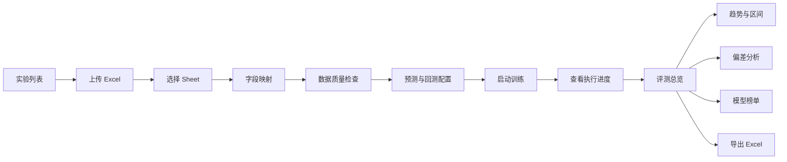
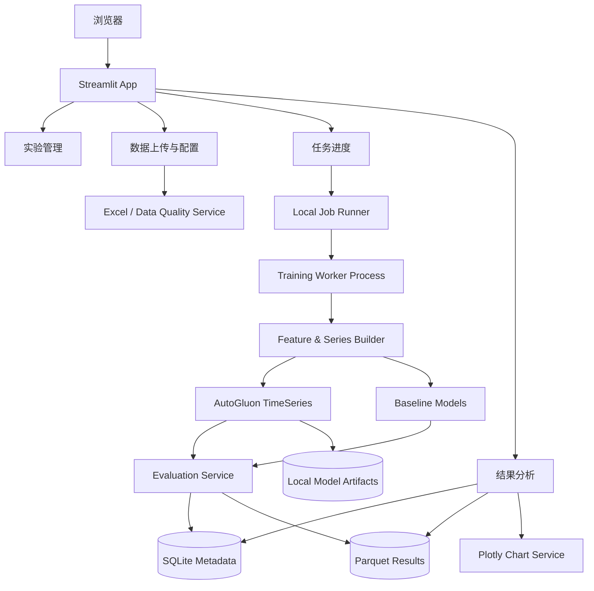

# 企业财务智能预测评测台（阶段一）AI-Native 开发 Spec

> 文档版本：v1.0  
> 产品定位：基于 Excel + AutoGluon TimeSeries 的企业财务预测评测实验台  
> 技术形态：Streamlit 多页面应用，单仓库、单机部署、可直接由 Codex / Claude Code 实现  
> 核心目标：验证“企业近三年财务数据是否具有可预测性，以及自动选模是否稳定优于简单基线”
AutoGluon项目地址： https://github.com/autogluon/autogluon
---

## 1. 产品结论

阶段一不建设完整预算系统，也不建设复杂的前后端分离平台。

本项目只解决一个核心问题：

> 财务人员上传近三年的 Excel 历史数据，系统自动完成数据检查、滚动回测、多模型训练、基线对比和未来预测，并以互联网企业级页面呈现预测趋势、实际值与预测值偏差、模型排行榜和可导出的评测结果。

产品本质是 **财务预测能力评测台**，不是“自动替代财务 Forecast”的生产系统。

### 1.1 阶段一技术决策

| 模块 | 技术选择 | 原因 |
|---|---|---|
| 页面应用 | Streamlit | Python 原生、开发周期短、适合算法验证 |
| 预测引擎 | AutoGluon TimeSeries | 自动训练多种时序模型、支持集成、排行榜和概率预测 |
| 数据处理 | Pandas + OpenPyXL | Excel 解析、字段清洗、结果导出 |
| 图表 | Plotly Graph Objects | 支持交互趋势图、预测区间、偏差柱状图和高级定制 |
| 元数据 | SQLite | 阶段一零运维，记录实验、任务和结果索引 |
| 明细结果 | Parquet | 适合保存预测明细和回测明细，读取快、体积小 |
| 模型文件 | 本地文件系统 | AutoGluon 原生模型目录直接持久化 |
| 任务执行 | 独立 Python 子进程 | 避免模型训练阻塞 Streamlit 页面，不引入 Redis/Celery |
| 包管理 | uv + pyproject.toml + uv.lock | 安装快、环境可复现 |
| Python | 3.12 | 兼顾 AutoGluon 支持范围与企业 Python 环境 |

### 1.2 阶段一明确不做

- 不做企业 SSO、组织权限和数据权限。
- 不做预算编制、审批、调整和版本下发。
- 不做 MySQL、Redis、Celery、Kafka 等基础设施。
- 不做在线数据源和企业 MCP 接入。
- 不做财务科目树层级预测协调与自动汇总平衡。
- 不做模型在线服务化和 REST API 对外发布。
- 不做复杂模型解释；只解释指标、误差、趋势和模型类型。
- 不自动修正异常值，不静默修改用户数据。
- 不承诺复杂模型一定优于简单模型。

---

## 2. 产品目标与验收标准

### 2.1 产品目标

1. 用户可以上传 Excel 并完成字段映射。
2. 系统可以识别数据是否满足时间序列预测条件。
3. 系统可以运行多个 AutoGluon 模型及三类简单业务基线。
4. 系统必须使用时间顺序滚动回测，不允许随机拆分。
5. 系统必须展示实际值、回测预测值、未来预测值及 P10-P90 区间。
6. 系统必须展示预测偏差金额、偏差率、WAPE、MAE、Bias 和区间覆盖率。
7. 系统必须明确回答最佳模型是否优于业务基线。
8. 用户可以按组织、科目、产品等 `item_id` 筛选查看明细。
9. 用户可以导出完整评测结果 Excel。
10. 页面视觉必须接近互联网企业数据产品，而不是默认 Streamlit Demo。

### 2.2 业务验收标准

| 维度 | 验收条件 |
|---|---|
| 数据上传 | 支持 `.xlsx`，单文件不超过 50MB，支持 Sheet 选择 |
| 字段配置 | 可配置时间字段、目标值字段、序列维度、已知未来变量、历史变量 |
| 数据质量 | 必须检查空值、重复、时间频率、序列长度、断档、非数值、异常波动 |
| 模型评测 | 至少训练 AutoGluon `fast_training` 或 `medium_quality` 中可用模型 |
| 基线 | 必须包含 Last Value、Seasonal Naive、Rolling Mean |
| 回测 | 月度数据默认预测 3 个月，默认 3 个滚动窗口；不足时自动降级并说明 |
| 结果展示 | 趋势图、偏差图、核心指标卡、模型榜单、序列明细表全部可用 |
| 结果结论 | 明确展示最佳模型相对最佳基线的 WAPE 提升率 |
| 导出 | 导出配置、质量报告、模型榜单、回测明细、未来预测、序列汇总 |
| 异常处理 | 页面不得直接暴露 Python Traceback，必须显示业务化错误信息 |

### 2.3 成功判断

阶段一的成功不是“页面跑起来”，而是完成以下判断：

- 哪些财务指标具有稳定可预测性。
- 自动模型是否优于去年同期或移动平均。
- 模型优势是否在多个回测窗口中稳定存在。
- 三年历史数据是否足够支撑当前预测粒度。
- 哪些指标必须引入业务驱动因子，而不能只靠历史数值。

---

## 3. 用户与核心场景

### 3.1 用户角色

阶段一只设置一种角色：**财务分析人员**。

该角色可以：

- 新建预测实验。
- 上传历史数据。
- 配置预测字段与参数。
- 启动、查看和取消训练任务。
- 查看评测结果与未来预测。
- 导出结果。
- 查看历史实验。

### 3.2 核心用户路径



### 3.3 关键产品原则

1. **先证明数据可预测，再讨论模型复杂度。**
2. **先与简单基线比较，再比较 AutoGluon 内部模型。**
3. **先展示误差，再展示漂亮的未来曲线。**
4. **不隐藏数据问题，不自动制造“好结果”。**
5. **默认参数足够可运行，高级参数保持克制。**

---

## 4. 总体架构



### 4.1 运行边界

- Streamlit 只负责页面、输入、状态轮询和结果展示。
- 模型训练必须在独立子进程中执行。
- Worker 负责读取实验配置、训练、计算指标、持久化结果。
- 页面不得直接持有 AutoGluon Predictor 大对象。
- 每个实验使用独立目录，避免文件覆盖。
- 阶段一默认同时只允许一个训练任务运行。

### 4.2 实验目录

```text
runtime/
├── app.db
├── uploads/
│   └── {experiment_id}/source.xlsx
├── experiments/
│   └── {experiment_id}/
│       ├── config.json
│       ├── data_profile.json
│       ├── normalized_data.parquet
│       ├── run.log
│       ├── progress.json
│       ├── models/
│       ├── results/
│       │   ├── leaderboard.parquet
│       │   ├── aggregate_metrics.parquet
│       │   ├── series_metrics.parquet
│       │   ├── backtest_predictions.parquet
│       │   ├── future_forecast.parquet
│       │   └── window_metrics.parquet
│       └── exports/
│           └── forecast_evaluation.xlsx
```

---

## 5. 工程目录规范

```text
finance-forecast-lab/
├── app.py
├── pages/
│   ├── experiments.py
│   ├── create_experiment.py
│   ├── run_status.py
│   └── result_analysis.py
├── src/
│   ├── core/
│   │   ├── config.py
│   │   ├── constants.py
│   │   ├── exceptions.py
│   │   └── logging.py
│   ├── domain/
│   │   ├── enums.py
│   │   ├── models.py
│   │   └── schemas.py
│   ├── repositories/
│   │   ├── experiment_repository.py
│   │   └── run_repository.py
│   ├── services/
│   │   ├── excel_service.py
│   │   ├── mapping_service.py
│   │   ├── data_quality_service.py
│   │   ├── series_builder.py
│   │   ├── baseline_service.py
│   │   ├── autogluon_service.py
│   │   ├── evaluation_service.py
│   │   ├── export_service.py
│   │   └── chart_service.py
│   ├── jobs/
│   │   ├── job_runner.py
│   │   └── train_worker.py
│   ├── storage/
│   │   ├── sqlite.py
│   │   ├── parquet.py
│   │   └── file_store.py
│   └── ui/
│       ├── theme.py
│       ├── components.py
│       ├── metric_cards.py
│       └── messages.py
├── tests/
│   ├── unit/
│   ├── integration/
│   └── fixtures/
├── sample_data/
│   ├── finance_monthly_demo.xlsx
│   └── finance_monthly_invalid.xlsx
├── scripts/
│   ├── init_db.py
│   ├── generate_demo_data.py
│   └── clean_runtime.py
├── .streamlit/
│   └── config.toml
├── pyproject.toml
├── uv.lock
├── Makefile
├── README.md
└── .env.example
```

### 5.1 分层约束

- `pages/` 不允许出现指标计算和模型训练代码。
- 所有财务指标计算必须集中在 `evaluation_service.py`。
- 所有 Plotly 图表构建必须集中在 `chart_service.py`。
- 所有数据库读写必须经过 Repository。
- Worker 与页面通过 SQLite、`progress.json` 和结果文件交互。
- 不允许使用全局变量保存实验状态。
- `st.session_state` 只保存当前页面交互状态；跨页面实验定位使用 `st.query_params` 中的 `experiment_id`。

---

## 6. 数据输入设计

## 6.1 Excel 最低要求

用户 Excel 不强制使用固定列名，但经过字段映射后必须形成：

| 标准字段 | 必填 | 说明 |
|---|---:|---|
| `timestamp` | 是 | 月、周或日时间字段 |
| `target` | 是 | 需要预测的实际金额或业务指标 |
| `item_id` | 是 | 一条独立时间序列，可由多个维度拼接生成 |
| `known_covariates` | 否 | 未来预测期间已知，如工作日数、预算人数、计划业务量 |
| `past_covariates` | 否 | 仅历史已知，如历史流量、历史人数、历史价格 |
| `static_features` | 否 | 序列不随时间变化的属性，如科目类型、组织类型 |

### 6.2 推荐上传模板

| 期间 | 组织 | 科目 | 产品 | 实际值 | 工作日数 | 预算人数 | 是否春节 |
|---|---|---|---|---:|---:|---:|---:|
| 2023-01 | 总部 | 人力成本 | 全部 | 1250000 | 17 | 128 | 1 |
| 2023-02 | 总部 | 人力成本 | 全部 | 1210000 | 20 | 128 | 0 |

默认生成：

```text
item_id = 组织 + " / " + 科目 + " / " + 产品
```

### 6.3 上传交互

1. 上传 `.xlsx`。
2. 显示文件名、大小、Sheet 数量和上传时间。
3. 用户选择 Sheet。
4. 展示前 50 行数据预览。
5. 自动猜测字段类型，但必须由用户确认。
6. 用户选择：
   - 时间字段。
   - 目标值字段。
   - 构成 `item_id` 的维度字段，可多选。
   - 已知未来变量。
   - 历史变量。
   - 静态属性。
7. 显示标准化后的 20 行预览。
8. 保存字段配置后进入数据质量检查。

### 6.4 时间字段解析规则

按以下顺序解析：

1. 原生 Excel 日期。
2. `YYYY-MM-DD`。
3. `YYYY/MM/DD`。
4. `YYYY-MM`。
5. `YYYYMM`。
6. `YYYY年第M月`。

无法解析的记录必须列出行号和原始值。

### 6.5 金额字段解析规则

允许：

- 整数、浮点数。
- 千分位逗号。
- 负数。
- 括号负数，如 `(1,200)`。
- 空字符串转换为缺失值，但不得默认转 0。

禁止：

- 混合币种符号未配置。
- 文本数字无法解析。
- 同一目标列出现多个非数值单位。

---

## 7. 数据质量检查

数据质量检查必须先于模型配置。

### 7.1 检查项

| 检查项 | 级别 | 规则 |
|---|---|---|
| 时间字段不可解析 | 阻断 | 任意记录无法解析均不得训练 |
| 目标值非数值 | 阻断 | 任意无法转换记录均不得训练 |
| `item_id + timestamp` 重复 | 阻断/可处理 | 用户必须选择聚合方式，默认不处理 |
| 序列过短 | 阻断或警告 | 依据频率和预测周期判断 |
| 时间断档 | 警告 | 显示每条序列缺失期间 |
| 频率不一致 | 阻断 | 同一实验必须统一为月、周或日 |
| 目标缺失 | 阻断/可处理 | 用户显式选择填充方式 |
| 零值比例过高 | 警告 | 超过 30% 提示稀疏序列 |
| 负值 | 信息 | 允许，但禁用 MAPE 作为主指标 |
| 异常波动 | 警告 | 使用 IQR 或同比变化阈值标记，不自动修改 |
| 常量序列 | 警告 | 全部值相同，模型无实际学习价值 |

### 7.2 序列长度规则

默认规则：

| 频率 | 最低可训练长度 | 建议长度 | 默认预测周期 |
|---|---:|---:|---:|
| 月度 | 24 | 36 及以上 | 3 个月 |
| 周度 | 52 | 104 及以上 | 8 周 |
| 日度 | 90 | 365 及以上 | 30 天 |

当序列长度不足以支持 3 个回测窗口时：

- 自动减少窗口数量。
- 最低保留 1 个窗口。
- 页面明显提示“评测稳定性较弱”。
- 不允许为了凑窗口随机拆分数据。

### 7.3 缺失值处理

用户必须明确选择：

- 不处理并阻断训练。
- 填 0。
- 前向填充。
- 线性插值。

默认选择：**不处理并阻断训练**。

页面必须显示处理前后数据量和受影响记录数。

### 7.4 重复记录处理

允许选择：

- 阻断并下载重复明细。
- 按金额求和。
- 取最后一条。
- 取平均值。

财务数据默认推荐“按金额求和”，但必须由用户确认，不得自动执行。

### 7.5 质量报告页面

顶部显示：

- 总记录数。
- 时间序列数。
- 时间范围。
- 平均序列长度。
- 阻断问题数。
- 警告数。

主体使用两栏：

- 左侧：问题类型、级别、影响记录数。
- 右侧：问题明细表和处理选项。

只有阻断问题清零后，“下一步：配置预测”按钮才可点击。

---

## 8. 预测实验配置

### 8.1 基础配置

| 参数 | 默认值 | 说明 |
|---|---|---|
| 实验名称 | `{目标字段}-{当前日期}` | 用户可修改 |
| 数据频率 | 自动识别 | 月、周、日 |
| 预测周期 | 月度 3 / 周度 8 / 日度 30 | 可调整 |
| 主评测指标 | WAPE | 财务整体金额偏差优先 |
| 回测窗口 | 3 | 数据不足时自动降级 |
| 窗口步长 | 等于预测周期 | 避免窗口过度重叠 |
| 预测分位数 | P10、P50、P90 | 用于区间展示 |
| 随机种子 | 123 | 保障可复现 |
| 集成模型 | 开启 | 使用 AutoGluon Weighted Ensemble |

### 8.2 训练模式

页面只向用户暴露三个业务化模式：

| 页面名称 | AutoGluon preset | 适用场景 |
|---|---|---|
| 快速验证 | `fast_training` | 首次判断数据是否可预测 |
| 标准评测 | `medium_quality` | 阶段一默认，兼顾模型丰富度和时间 |
| 深度评测 | `high_quality` | 数据规模较大、机器资源充足 |

默认：**标准评测**。

### 8.3 时间限制

- 快速验证：默认 600 秒。
- 标准评测：默认 1800 秒。
- 深度评测：默认 3600 秒。
- 用户可修改，但最小 120 秒，最大 14400 秒。

时间限制表示训练预算，不承诺所有模型均完成。

### 8.4 已知未来变量

当配置了 `known_covariates`：

- 用户必须同时上传未来预测周期的变量值。
- 必须覆盖全部 `item_id` 和全部未来时间点。
- 缺失任一未来变量时阻断未来预测。
- 允许先完成回测，但未来预测页显示“未来变量不完整”。

### 8.5 配置确认页

启动训练前展示确认摘要：

- 数据范围与序列数量。
- 目标字段。
- 序列维度。
- 预测频率与周期。
- 回测窗口。
- 训练模式与时间预算。
- 已知未来变量。
- 数据处理动作。

主按钮：`开始评测`。

次按钮：`返回修改`。

---

## 9. 预测与评测逻辑

## 9.1 AutoGluon Predictor 配置

参考实现：

```python
predictor = TimeSeriesPredictor(
    target="target",
    prediction_length=config.prediction_length,
    freq=config.freq,
    eval_metric="WAPE",
    quantile_levels=[0.1, 0.5, 0.9],
    known_covariates_names=config.known_covariates,
    path=model_path,
)

predictor.fit(
    train_data=train_data,
    presets=config.preset,
    time_limit=config.time_limit_seconds,
    num_val_windows=config.num_val_windows,
    val_step_size=config.val_step_size,
    refit_every_n_windows="auto",
    refit_full=True,
    enable_ensemble=True,
    random_seed=123,
)
```

### 9.2 AutoGluon 原始分数处理

AutoGluon Leaderboard 中部分误差指标会以“越大越好”的负数形式展示。

页面不得直接把 `score_val=-0.12` 展示给财务用户。

必须：

1. 保存 AutoGluon 原始 Leaderboard，供技术诊断。
2. 对每个模型获取回测预测结果。
3. 使用本项目统一指标函数重新计算 WAPE、MAE、RMSE、Bias。
4. 页面只显示正向、可读的误差指标。
5. 技术明细中可折叠展示 AutoGluon 原始分数。

### 9.3 基线模型

系统必须独立实现以下基线，并与 AutoGluon 使用相同回测窗口：

#### Baseline 1：Last Value

```text
下一期预测值 = 最近一期实际值
```

#### Baseline 2：Seasonal Naive

```text
月度：预测值 = 去年同期实际值
周度：预测值 = 去年同周实际值
日度：默认预测值 = 上周同日实际值
```

#### Baseline 3：Rolling Mean

```text
月度：最近 3 期平均
周度：最近 4 期平均
日度：最近 7 期平均
```

### 9.4 最佳模型选择规则

1. 按聚合层 WAPE 从低到高排序。
2. WAPE 相同时，选择绝对 Bias 更小者。
3. 仍相同时，选择 MAE 更小者。
4. 仍相同时，选择预测时间更短者。
5. AutoGluon Ensemble 与单模型使用同一规则。
6. 基线可进入总榜单，但必须标识类型为“业务基线”。

### 9.5 财务指标定义

#### 误差

```text
error = forecast - actual
```

- `error > 0`：高估。
- `error < 0`：低估。

#### 绝对误差

```text
absolute_error = abs(forecast - actual)
```

#### 偏差率

```text
error_rate = (forecast - actual) / abs(actual)
```

当实际值为 0：

- 不计算单点偏差率。
- 页面显示 `—`。
- 聚合 WAPE 仍可计算，前提是总体实际值绝对值之和不为 0。

#### WAPE

```text
WAPE = sum(abs(forecast - actual)) / sum(abs(actual))
```

#### MAE

```text
MAE = mean(abs(forecast - actual))
```

#### RMSE

```text
RMSE = sqrt(mean((forecast - actual)^2))
```

#### Bias 金额

```text
Bias Amount = sum(forecast - actual)
```

#### Bias Rate

```text
Bias Rate = sum(forecast - actual) / sum(abs(actual))
```

#### 预测区间覆盖率

```text
Coverage = count(P10 <= actual <= P90) / count(valid actual)
```

#### 相对基线提升率

```text
Improvement = (baseline_wape - model_wape) / baseline_wape
```

### 9.6 评测层级

所有指标至少计算三层：

1. **实验聚合层**：全部序列、全部回测点聚合。
2. **单序列层**：每个 `item_id` 聚合。
3. **回测窗口层**：每个时间窗口聚合。

不得只展示一个总体平均数。

### 9.7 稳定性判断

| 状态 | 规则 |
|---|---|
| 稳定领先 | 超过 70% 回测窗口优于最佳基线 |
| 有一定优势 | 50%-70% 窗口优于最佳基线 |
| 不稳定 | 少于 50% 窗口优于最佳基线 |
| 不可判断 | 仅有 1 个回测窗口 |

### 9.8 业务结论生成

结果页顶部自动生成确定性结论，不使用大模型：

示例：

> WeightedEnsemble 为本次最佳模型，聚合 WAPE 为 11.8%，较最佳业务基线 Seasonal Naive 的 15.2% 改善 22.4%。该模型在 3 个回测窗口中有 3 个优于基线，当前结果属于“稳定领先”。但仍有 8 条序列 WAPE 高于 30%，建议进一步检查异常值或补充业务驱动变量。

结论模板必须基于真实指标生成，禁止输出无依据的“效果很好”。

---

## 10. 任务执行与进度

### 10.1 任务状态

```text
DRAFT
VALIDATED
QUEUED
RUNNING
SUCCEEDED
FAILED
CANCELLED
```

### 10.2 Worker 阶段

```text
1. LOAD_DATA
2. NORMALIZE_DATA
3. BUILD_BACKTEST_WINDOWS
4. TRAIN_BASELINES
5. TRAIN_AUTOGLUON
6. GENERATE_BACKTEST_PREDICTIONS
7. CALCULATE_METRICS
8. REFIT_BEST_MODEL
9. GENERATE_FUTURE_FORECAST
10. BUILD_EXPORT
11. COMPLETE
```

### 10.3 progress.json 示例

```json
{
  "experiment_id": "exp_20260614_001",
  "status": "RUNNING",
  "stage": "TRAIN_AUTOGLUON",
  "progress": 45,
  "message": "正在训练并比较候选模型",
  "started_at": "2026-06-14T10:30:00",
  "updated_at": "2026-06-14T10:37:12"
}
```

### 10.4 运行页面

页面结构：

- 顶部：实验名称、状态 Badge、运行时长。
- 中部：横向步骤条。
- 当前步骤：简短业务说明。
- 下方：可折叠运行日志，默认收起。
- 右上：取消任务按钮。

页面每 2 秒轮询一次状态。

不得显示虚假的模型级百分比。若 AutoGluon 无法提供精确进度，则只显示阶段进度和运行时长。

### 10.5 失败处理

失败时必须记录：

- 失败阶段。
- 用户可读错误摘要。
- 技术错误日志路径。
- 可执行建议。

示例：

> 标准评测未完成：部分深度学习模型依赖下载失败。可以检查网络后重试，或切换到“快速验证”模式。

---

## 11. 页面信息架构

使用 Streamlit `st.navigation(position="top")` 构建顶部导航，避免传统工具型侧边栏占据主视觉。

### 11.1 顶部导航

```text
品牌：Forecast Lab
导航：实验列表 | 新建实验
右侧：运行环境 / 帮助
```

查看某个实验后，结果页内部使用 Tab：

```text
评测总览 | 趋势分析 | 偏差分析 | 模型榜单 | 数据与配置
```

### 11.2 页面清单

| 页面 | 路径 | 核心职责 |
|---|---|---|
| 实验列表 | `/experiments` | 查看历史实验、新建、进入结果 |
| 新建实验 | `/new` | 上传、映射、质量、配置、确认 |
| 运行状态 | `/run?experiment_id={id}` | 展示训练阶段、日志、取消 |
| 结果分析 | `/result?experiment_id={id}` | 展示趋势、偏差、榜单和导出 |

---

## 12. 页面详细设计

## 12.1 实验列表页

### 页面头部

- 标题：`财务预测实验`
- 副标题：`通过历史回测比较不同模型，判断财务指标是否具备稳定预测能力。`
- 主按钮：`新建实验`

### 筛选区

- 搜索实验名称。
- 状态筛选。
- 创建日期范围。
- 数据频率筛选。

### 实验卡片/表格

列：

- 实验名称。
- 目标指标。
- 数据范围。
- 序列数。
- 最佳模型。
- WAPE。
- 相对基线提升。
- 状态。
- 创建时间。
- 操作。

状态色：

- 成功：绿色 Badge。
- 运行中：蓝色 Badge。
- 失败：红色 Badge。
- 草稿：灰色 Badge。

空状态：

- 简洁插图或图标。
- 文案：`还没有预测实验。上传一份历史数据，先验证它是否具有可预测性。`
- 按钮：`创建第一个实验`

## 12.2 新建实验页

使用顶部四步 Stepper：

```text
1 上传数据 → 2 字段与质量 → 3 预测配置 → 4 确认运行
```

### Step 1：上传数据

页面主体是一张大尺寸上传卡片：

- 支持拖拽和点击。
- 支持下载示例模板。
- 上传后显示文件摘要。
- Sheet 选择后显示表格预览。

### Step 2：字段与质量

左侧 36%：字段映射表单。  
右侧 64%：数据预览和质量结果。

移动到窄屏时改为上下布局。

### Step 3：预测配置

配置区域分为三张卡片：

1. 预测范围。
2. 回测与指标。
3. 训练模式。

高级选项默认收起。

### Step 4：确认运行

展示只读摘要和风险提示。

若月度数据仅 24-35 个月，顶部显示黄色提示：

> 当前历史周期较短，模型排名可能受单个回测窗口影响。建议将结果视为方向性验证。

## 12.3 运行状态页

视觉重点是“当前正在做什么”，不是技术日志。

```text
正在评测 · 已运行 08:32
[数据准备]—[基线模型]—[AutoGluon训练]—[回测评估]—[未来预测]
                         ↑ 当前
```

右侧信息卡：

- 训练模式。
- 时间预算。
- 序列数。
- 预测周期。
- 当前 PID。

## 12.4 评测总览页

### 第一屏布局

#### A. 结论卡

横跨全宽，包含：

- 最佳模型名称。
- 一句话结论。
- 稳定性 Badge。
- `导出评测报告` 按钮。

#### B. 核心指标卡

五张并排指标卡：

1. 最佳模型 WAPE。
2. 最佳基线 WAPE。
3. 相对基线提升率。
4. Bias Rate。
5. P10-P90 覆盖率。

每张卡包含：

- 指标名称。
- 大数字。
- 解释性副文本。
- 相对上一对象的 Delta，避免无意义装饰。

#### C. 核心趋势图

显示聚合实际值、回测预测和未来预测。

#### D. 风险提示

最多展示三条：

- 误差最高的序列。
- 不稳定窗口。
- 数据长度或断档风险。

### 第二屏布局

左 60%：回测窗口表现。  
右 40%：模型与基线 Top 5。

## 12.5 趋势分析页

顶部筛选栏：

- `item_id` 搜索与下拉。
- 模型选择。
- 时间范围。
- 聚合/单序列切换。

主体：

1. 实际值与预测值趋势图。
2. 预测区间说明。
3. 期间明细表。

### 趋势图必须包含

- 历史实际值：深灰色实线。
- 回测期间实际值：黑色实线，圆点。
- 回测预测值：主色实线或虚线。
- 未来 P50：主色实线。
- P10-P90：浅色半透明带。
- 预测起点：垂直虚线。
- 鼠标 Tooltip：期间、实际值、预测值、偏差金额、偏差率、P10、P90。

### 趋势图交互

- 图例可点击隐藏。
- 支持框选缩放。
- 双击恢复。
- 金额自动使用万、百万、亿格式，但 Tooltip 显示完整数字。
- 无实际值的未来期间不显示偏差。

## 12.6 偏差分析页

顶部指标：

- 总偏差金额。
- Bias Rate。
- 最大高估期间。
- 最大低估期间。
- 偏差超过阈值的期间数。

### 偏差图 1：按期间偏差柱状图

```text
偏差 = 预测值 - 实际值
```

- 高估：暖红色柱。
- 低估：蓝色柱。
- 零线必须明显。
- Tooltip 显示实际、预测、偏差金额和偏差率。

### 偏差图 2：实际值 vs 预测值

默认使用散点图：

- X 轴：实际值。
- Y 轴：预测值。
- 45 度参考线表示完美预测。
- 偏离参考线越远，误差越大。
- 点击点后显示对应 `item_id` 和期间。

### 偏差明细表

列：

- 期间。
- `item_id`。
- 实际值。
- 预测值。
- 偏差金额。
- 偏差率。
- 误差等级。
- 回测窗口。

条件格式：

- 偏差率绝对值 `<10%`：正常。
- `10%-20%`：关注。
- `>20%`：高风险。

阈值可在配置中调整，默认 10%/20%。

## 12.7 模型榜单页

榜单必须把业务基线和 AutoGluon 模型放在同一评测框架中。

列：

| 列 | 说明 |
|---|---|
| 排名 | 按 WAPE 排序 |
| 模型 | 模型名称 |
| 类型 | 基线 / 统计 / 机器学习 / 深度学习 / 集成 |
| WAPE | 主指标 |
| MAE | 金额误差 |
| Bias Rate | 高估或低估倾向 |
| 稳定窗口 | 优于基线窗口数 / 总窗口数 |
| 训练耗时 | 秒或分钟 |
| 推理耗时 | 秒 |
| 状态 | 完成 / 超时 / 失败 |

交互：

- 最佳模型显示 `最佳` Badge。
- 最佳基线显示 `基线最佳` Badge。
- 可选择任意模型进入趋势页比较。
- 默认只显示前 10 名，支持展开全部。
- 失败模型不参与排名，但可查看错误原因。

## 12.8 数据与配置页

展示：

- 原始文件信息。
- 字段映射。
- 数据质量摘要。
- 数据处理动作。
- 预测参数。
- 模型参数。
- 软件版本。
- 实验运行日志。

该页用于保证实验可追溯。

---

## 13. 图表视觉规范

## 13.1 整体设计语言

关键词：

```text
克制、清晰、专业、数据优先、轻量阴影、大留白、低饱和度
```

避免：

- 大面积渐变。
- 炫光或玻璃拟态。
- 过多彩色图标。
- 高饱和度彩虹图表。
- 每张卡片都加重阴影。
- 页面充满边框。
- 把所有技术日志默认展开。

## 13.2 页面尺寸

- `layout="wide"`。
- 主内容最大宽度约 1360px，居中。
- 适配 1280px、1440px 和 1920px 屏幕。
- 页面左右边距 24-32px。
- 卡片间距 16px。
- 区块间距 24-32px。

## 13.3 色彩体系

| 用途 | 色值 |
|---|---|
| 品牌主色 | `#4F46E5` |
| 主文字 | `#101828` |
| 次文字 | `#667085` |
| 页面背景 | `#F7F8FA` |
| 卡片背景 | `#FFFFFF` |
| 边框 | `#E4E7EC` |
| 成功 | `#12B76A` |
| 警告 | `#F79009` |
| 错误/高估风险 | `#F04438` |
| 低估 | `#2E90FA` |
| 中性灰 | `#98A2B3` |

## 13.4 图表颜色

| 数据 | 颜色/样式 |
|---|---|
| 实际值 | `#101828` 实线 |
| 最佳模型预测 | `#4F46E5` 实线 |
| 业务基线 | `#98A2B3` 虚线 |
| P10-P90 区间 | `rgba(79,70,229,0.12)` |
| 高估偏差 | `#F04438` |
| 低估偏差 | `#2E90FA` |
| 参考线 | `#D0D5DD` 虚线 |

单图最多展示 4 条主要序列。更多模型通过下拉切换，不允许同时堆叠十几条线。

## 13.5 字体

```css
font-family: -apple-system, BlinkMacSystemFont, "Segoe UI", "PingFang SC",
             "Microsoft YaHei", "Helvetica Neue", Arial, sans-serif;
```

字号：

- 页面标题：28px / 600。
- 区块标题：18px / 600。
- 卡片大数字：28-32px / 600。
- 正文：14px / 400。
- 辅助文字：12px / 400。

## 13.6 卡片

- 圆角：12px。
- 边框：1px `#E4E7EC`。
- 阴影：`0 1px 2px rgba(16,24,40,0.04)`。
- 内边距：20-24px。
- Hover 仅用于可点击卡片，不为静态指标卡添加动画。

## 13.7 Plotly 全局规范

- 背景透明。
- 不显示默认 Plotly Logo。
- Modebar 只保留缩放、重置和下载图片。
- 网格线使用浅灰细线。
- 默认高度：趋势图 420px，偏差图 340px。
- Legend 放在顶部横向排列。
- Hover 使用统一白底卡片。
- 坐标轴标题尽可能简化。
- 金额轴使用紧凑格式，Tooltip 使用完整财务格式。

---

## 14. Streamlit 主题配置

`.streamlit/config.toml`：

```toml
[server]
maxUploadSize = 50
headless = true

[browser]
gatherUsageStats = false

[theme]
base = "light"
primaryColor = "#4F46E5"
backgroundColor = "#F7F8FA"
secondaryBackgroundColor = "#FFFFFF"
textColor = "#101828"
linkColor = "#4F46E5"
baseRadius = "0.75rem"
buttonRadius = "0.6rem"
borderColor = "#E4E7EC"
dataframeBorderColor = "#E4E7EC"
dataframeHeaderBackgroundColor = "#F9FAFB"
showWidgetBorder = true
font = "sans-serif"
headingFont = "sans-serif"
baseFontSize = 14
chartCategoricalColors = ["#4F46E5", "#2E90FA", "#12B76A", "#F79009", "#F04438", "#98A2B3"]

[theme.sidebar]
backgroundColor = "#FFFFFF"
secondaryBackgroundColor = "#F9FAFB"
textColor = "#344054"
borderColor = "#E4E7EC"
```

允许少量 CSS 修正页面宽度、顶部间距、Metric 卡片和隐藏默认页脚，但禁止大规模依赖不稳定 DOM 选择器。

---

## 15. 数据模型

## 15.1 experiments

| 字段 | 类型 | 说明 |
|---|---|---|
| id | TEXT PK | 实验 ID |
| name | TEXT | 实验名称 |
| status | TEXT | 实验状态 |
| source_file | TEXT | 上传文件路径 |
| sheet_name | TEXT | Sheet 名称 |
| target_column | TEXT | 原始目标字段 |
| timestamp_column | TEXT | 原始时间字段 |
| item_columns_json | TEXT | 序列维度字段 |
| config_json | TEXT | 完整实验配置 |
| data_start | TEXT | 数据开始时间 |
| data_end | TEXT | 数据结束时间 |
| item_count | INTEGER | 序列数量 |
| row_count | INTEGER | 记录数量 |
| best_model | TEXT | 最佳模型 |
| best_wape | REAL | 最佳 WAPE |
| baseline_wape | REAL | 最佳基线 WAPE |
| improvement_rate | REAL | 相对基线提升率 |
| created_at | TEXT | 创建时间 |
| updated_at | TEXT | 更新时间 |

## 15.2 runs

| 字段 | 类型 | 说明 |
|---|---|---|
| id | TEXT PK | 运行 ID |
| experiment_id | TEXT | 实验 ID |
| status | TEXT | 运行状态 |
| stage | TEXT | 当前阶段 |
| progress | INTEGER | 阶段性百分比 |
| worker_pid | INTEGER | 子进程 PID |
| started_at | TEXT | 开始时间 |
| ended_at | TEXT | 结束时间 |
| error_code | TEXT | 错误编码 |
| error_message | TEXT | 用户可读错误 |
| log_path | TEXT | 日志路径 |

### 15.3 预测明细结构

`backtest_predictions.parquet`：

| 字段 | 说明 |
|---|---|
| item_id | 序列 ID |
| timestamp | 预测期间 |
| window_id | 回测窗口 |
| model | 模型名称 |
| actual | 实际值 |
| forecast_mean | 均值预测 |
| forecast_p10 | P10 |
| forecast_p50 | P50 |
| forecast_p90 | P90 |
| error | 偏差金额 |
| absolute_error | 绝对偏差 |
| error_rate | 偏差率 |

`future_forecast.parquet` 与上述结构一致，但 `actual/error` 为空。

---

## 16. 导出 Excel 规范

导出文件名：

```text
{实验名称}_预测评测_{YYYYMMDD_HHmm}.xlsx
```

Sheet：

1. `评测结论`
2. `模型排行榜`
3. `回测汇总`
4. `序列评测`
5. `期间偏差明细`
6. `未来预测`
7. `数据质量`
8. `实验配置`

### 16.1 评测结论 Sheet

必须包含：

- 实验信息。
- 最佳模型。
- 最佳基线。
- WAPE、MAE、Bias、覆盖率。
- 相对基线提升率。
- 稳定性判断。
- 高风险序列 Top 10。
- 自动生成业务结论。

### 16.2 导出格式

- 表头冻结。
- 开启筛选。
- 百分比使用百分比格式。
- 金额使用千分位。
- 偏差高风险使用条件格式。
- 不写入模型二进制文件。

---

## 17. 错误码

| 错误码 | 场景 | 页面文案方向 |
|---|---|---|
| FILE_UNSUPPORTED | 文件类型错误 | 仅支持 `.xlsx` 文件 |
| FILE_TOO_LARGE | 文件超过限制 | 文件不能超过 50MB |
| SHEET_EMPTY | Sheet 无数据 | 当前 Sheet 没有可用记录 |
| TIME_PARSE_FAILED | 时间解析失败 | 下载错误明细并修正时间字段 |
| TARGET_PARSE_FAILED | 金额解析失败 | 修正非数值记录 |
| DUPLICATE_SERIES_TIME | 序列期间重复 | 选择聚合方式或修正源数据 |
| SERIES_TOO_SHORT | 序列过短 | 减少预测周期或补充历史数据 |
| FUTURE_COVARIATE_MISSING | 未来变量缺失 | 补充未来周期变量值 |
| TRAINING_DEPENDENCY_FAILED | 模型依赖失败 | 检查网络或切换快速模式 |
| TRAINING_OOM | 内存不足 | 减少模型模式或序列数量 |
| TRAINING_TIMEOUT | 达到时间上限 | 已保留完成模型，允许查看部分结果 |
| RESULT_NOT_FOUND | 结果文件缺失 | 重新运行实验 |
| EXPORT_FAILED | 导出失败 | 保留实验结果，可重试导出 |

---

## 18. 性能与稳定性要求

### 18.1 基准数据集

阶段一使用以下基准：

- 月度数据。
- 36 个月。
- 50 条序列。
- 1800 行记录。
- 3 个月预测周期。
- 3 个回测窗口。

### 18.2 性能目标

- Excel 上传并预览：5 秒内。
- 数据质量检查：10 秒内。
- 结果页读取已落盘数据：3 秒内完成首屏。
- 筛选单序列并刷新图表：2 秒内。
- 导出 Excel：10 秒内。
- 模型训练严格受 `time_limit` 控制。

### 18.3 资源保护

- 默认只允许一个 RUNNING 任务。
- Worker 内存异常必须标记失败，不得拖垮 Streamlit 主进程。
- 页面只加载筛选所需明细，不一次性渲染全部百万级记录。
- `st.cache_data` 仅用于读取不变的 Parquet 和汇总数据。
- 模型对象不得使用 `st.cache_resource` 长期驻留。
- 上传文件和实验目录必须隔离。

---

## 19. 日志与可追溯性

每次实验必须记录：

- 软件版本。
- Python 版本。
- AutoGluon 版本。
- Streamlit 版本。
- 输入文件 SHA256。
- 字段映射。
- 数据处理动作。
- 实验参数。
- 模型列表及状态。
- 训练开始、结束和耗时。
- 随机种子。
- 错误摘要。

日志分级：

- INFO：正常阶段。
- WARNING：模型失败、数据警告、窗口降级。
- ERROR：任务失败。

日志不得记录完整财务明细值，只记录行数、字段名、范围和统计摘要。

---

## 20. 测试要求

## 20.1 单元测试

必须覆盖：

- 时间字段解析。
- 括号负数和千分位金额解析。
- `item_id` 构建。
- 重复记录检测与聚合。
- 频率识别。
- 缺失期间识别。
- WAPE、MAE、RMSE、Bias、Coverage。
- 实际值为 0 的偏差率处理。
- 基线模型预测。
- 最佳模型选择规则。
- 稳定性判断。

### 20.2 集成测试

使用合成月度财务数据完成：

1. 上传解析。
2. 数据标准化。
3. 快速模式训练。
4. 基线评测。
5. 结果持久化。
6. 图表数据生成。
7. Excel 导出。

### 20.3 页面验收

- 1440px 屏幕不出现横向滚动。
- 1280px 下指标卡可以自然换行。
- 所有按钮有禁用态和明确反馈。
- 空状态、加载态、失败态、成功态齐全。
- 图表 Tooltip 不遮挡核心数据。
- 表格列名使用财务语言，而非 Python 字段名。
- 技术日志默认折叠。

---

## 21. AI-Native 开发约束

### 21.1 开发原则

1. 先实现完整闭环，再优化局部视觉。
2. 不提前引入前后端分离、消息队列和云服务。
3. 预测计算和页面展示必须解耦。
4. 每个阶段完成后必须有可运行结果和测试。
5. 不在页面脚本中堆积业务逻辑。
6. 不使用 Mock 结果伪装训练成功。
7. 示例数据与用户数据路径严格分离。
8. 所有路径使用 `pathlib.Path`。
9. 所有核心函数使用类型标注。
10. 所有实验计算必须可重复执行。

### 21.2 实现顺序

#### Milestone 1：项目骨架

- 初始化 uv 项目。
- 建立 Streamlit 多页面导航。
- 完成主题配置。
- 初始化 SQLite。
- 完成实验列表空状态。

验收：`make run` 可启动应用。

#### Milestone 2：Excel 上传与字段映射

- 文件上传。
- Sheet 选择。
- 字段猜测与映射。
- 标准化数据预览。
- 保存草稿实验。

验收：示例 Excel 可生成规范长表。

#### Milestone 3：数据质量

- 完成全部阻断检查和警告。
- 缺失和重复处理。
- 质量报告展示。

验收：无效示例数据能够被准确阻断。

#### Milestone 4：基线与指标

- 完成三类基线。
- 完成滚动回测窗口。
- 完成指标计算和单元测试。

验收：人工构造小样本可验证计算结果。

#### Milestone 5：AutoGluon Worker

- 独立子进程训练。
- 状态写入。
- AutoGluon 模型和 Leaderboard 持久化。
- 失败模型隔离。

验收：关闭或刷新页面后训练任务仍继续，重新进入可查看状态。

#### Milestone 6：结果页

- 核心指标卡。
- 实际与预测趋势图。
- P10-P90 区间。
- 偏差柱状图。
- 模型排行榜。
- 序列筛选。

验收：完整回答“哪个模型最好、比基线好多少、误差发生在哪里”。

#### Milestone 7：导出与完善

- 完成 Excel 导出。
- 完成异常状态。
- 完成 README、示例数据和测试。
- 完成页面视觉 QA。

验收：新环境按 README 可一次启动。

### 21.3 代码质量要求

- 使用 Ruff 进行 lint 和 format。
- 使用 Pytest。
- 核心 Pydantic Schema 禁止使用无类型 `dict`。
- 单函数建议不超过 60 行。
- 页面文件建议不超过 300 行。
- 指标计算函数必须为纯函数。
- 图表函数输入 DataFrame，输出 `go.Figure`。
- 数据库存储时间统一使用 ISO 8601。
- 不捕获裸 `Exception` 后静默忽略。

---

## 22. 依赖建议

`pyproject.toml` 核心依赖：

```toml
[project]
requires-python = ">=3.12,<3.13"
dependencies = [
  "streamlit>=1.58,<1.59",
  "autogluon.timeseries>=1.5,<1.6",
  "pandas>=2.2,<3",
  "pyarrow>=18,<22",
  "openpyxl>=3.1,<4",
  "plotly>=6.0,<7",
  "pydantic>=2.10,<3",
  "sqlmodel>=0.0.24,<0.1",
  "python-dotenv>=1.0,<2",
]

[dependency-groups]
dev = [
  "pytest>=8,<9",
  "ruff>=0.11,<1",
  "mypy>=1.15,<2",
]
```

最终版本必须提交 `uv.lock`，以锁定真实安装版本。

### 22.1 本地命令

```makefile
install:
	uv sync

run:
	uv run streamlit run app.py

test:
	uv run pytest -q

lint:
	uv run ruff check .
	uv run ruff format --check .

format:
	uv run ruff check --fix .
	uv run ruff format .

clean-runtime:
	uv run python scripts/clean_runtime.py
```

---

## 23. README 必须包含

1. 项目定位。
2. 系统截图。
3. 环境要求。
4. 安装步骤。
5. 启动命令。
6. 示例数据说明。
7. Excel 字段要求。
8. 训练模式说明。
9. 结果指标解释。
10. 常见问题：模型下载、内存不足、Mac/CPU 运行、时间过长。
11. 数据隐私说明：文件仅保存在本地运行目录。
12. 清理实验数据的方法。

---

## 24. 最终 Definition of Done

满足以下全部条件才算阶段一完成：

- [ ] 可以上传并解析企业财务 Excel。
- [ ] 可以选择 Sheet 和映射字段。
- [ ] 可以构建多条 `item_id` 时间序列。
- [ ] 可以完成数据质量检查和显式处理。
- [ ] 可以配置频率、预测周期、回测窗口和训练模式。
- [ ] 可以在独立 Worker 中运行 AutoGluon。
- [ ] 可以运行三类业务基线。
- [ ] 可以获取并重新计算所有模型的统一评测指标。
- [ ] 可以展示最佳模型相对最佳基线的提升率。
- [ ] 可以展示实际值、回测预测值、未来预测值和 P10-P90 区间。
- [ ] 可以展示实际值与预测值的期间偏差柱状图。
- [ ] 可以按单条序列筛选查看趋势与偏差。
- [ ] 可以展示模型排行榜和回测稳定性。
- [ ] 可以导出完整 Excel 评测结果。
- [ ] 页面通过 1280px/1440px 视觉验收。
- [ ] 异常状态不暴露 Traceback。
- [ ] 核心指标有单元测试。
- [ ] 新环境执行 `uv sync && make run` 可以启动。
- [ ] README、示例数据、环境配置和清理脚本齐全。

---

## 25. 开发完成后的业务判断模板

系统完成后，项目评审只回答以下五个问题：

1. 最佳 AutoGluon 模型是什么？
2. 它是否稳定优于 Last Value、Seasonal Naive 和 Rolling Mean？
3. 相对最佳基线，WAPE 改善了多少？
4. 哪些组织/科目/产品序列预测效果差？
5. 下一步应该补充历史数据、业务变量，还是停止对该指标做纯时序预测？

阶段一不以“模型数量多”作为价值，而以“能否形成可信的财务预测判断”作为价值。

---

## 26. 官方技术依据

- AutoGluon TimeSeries 支持概率多步预测、均值与分位数预测。
- `TimeSeriesPredictor.leaderboard()` 可返回模型验证得分、测试得分、训练和预测耗时。
- AutoGluon 1.5 的 `fit()` 支持 `fast_training`、`medium_quality`、`high_quality`、`best_quality` 等 preset，以及多窗口回测参数。
- AutoGluon 的误差型排行榜分数会转换为“越大越好”形式，因此产品层必须重新计算并展示财务可读指标。
- Streamlit 支持文件上传、多页面导航、容器、主题和下载能力。
- Plotly 支持交互时间序列和连续误差带，可用于 P10-P90 预测区间。

